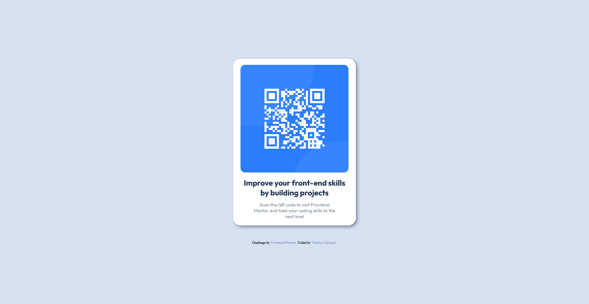
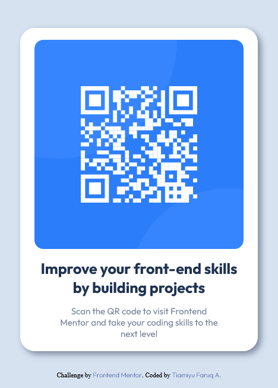

# Frontend Mentor - QR code component solution

This is a solution to the [QR code component challenge on Frontend Mentor](https://www.frontendmentor.io/challenges/qr-code-component-iux_sIO_H). Frontend Mentor challenges help you improve your coding skills by building realistic projects. 

## Table of contents

- [Overview](#overview)
  - [Screenshot](#screenshot)
  - [Links](#links)
- [My process](#my-process)
  - [Built with](#built-with)
  - [What I learned](#what-i-learned)
  - [Useful resources](#useful-resources)
- [Author](#author)

## Overview

### Screenshot

### Links

- Solution URL: (https://github.com/bi9bos/revision-through-exercises/tree/demo-1)
- Live Site URL: (https://b9ndesigns-qrcode-component.netlify.app)

## My process

### Built with

- Semantic HTML5 markup
- CSS custom properties
- Flexbox
- CSS Variables
- Mobile-first workflow

### What I learned

I learnt to use font face to style my design's fonts offline and practiced more on flexbox, variables and html/css semantics overall

### Useful resources

- [CSS Tricks](https://www.google.com/url?sa=t&source=web&cd=&cad=rja&uact=8&ved=2ahUKEwixoOCPsLf5AhXJX_EDHT3dCAQQFnoECBwQAQ&url=https%3A%2F%2Fcss-tricks.com%2Fsnippets%2Fcss%2Fusing-font-face-in-css%2F&usg=AOvVaw2oiN_CRRGU5zNF47ud05wH) - This helped me for using fontface in using downloaded google fonts for offline use.

## Author

- Frontend Mentor - [@bi9bos](https://www.frontendmentor.io/profile/bi9bos)
- Twitter - [@b9bos1](https://www.twitter.com/b9bos1)
